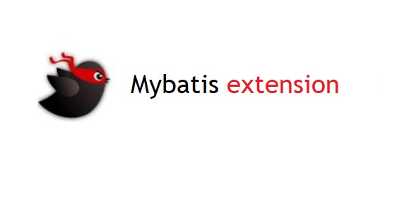

# Mybatis 增强包 



增加了通用Mapper,提供了四种单表操作方法

 - `int insert(T entity)` 需要自行处理主键
 - `int updateById(T entity)` 根据主键ID更新记录
 - `int deleteById(PK id)` 根据主键ID删除记录
 - `T findById(PK id)`  根据主键ID查询记录
 
 
## 依赖

本增强包仅仅对`mybatis-spring-boot-starter`作了增强。

```xml
        <dependency>
            <groupId>org.mybatis.spring.boot</groupId>
            <artifactId>mybatis-spring-boot-starter</artifactId>
            <version>${mybatis.boot.version}</version>
        </dependency>
``` 
然后把本项目集成到你的项目中去。可通过**Maven**的`mvn install` 安装到本地后引用：
```xml
        <dependency>
            <groupId>cn.felord.mybatis</groupId>
            <artifactId>mybatis-mapper-extension</artifactId>
            <version>1.0.0.RELEASE</version>
        </dependency>
``` 
## 配置
- 需要使用注解`@MapperScan`配置`factoryBean`为`cn.felord.mybatis.MybatisMapperFactoryBean.class`。 
- 需要配置`mybatis.configuration.map-underscore-to-camel-case = true`以启用下划线到驼峰命名风格的映射。

其它配置参考**Mybatis**自己的配置。
 
 
## 使用方法
配置完毕后下面是具体使用步骤。

## 实体类
实体类需要添加主键注解 `@PrimaryKey` 。
```java
/**
 * @author felord.cn
 * @since 15:43
 **/
@Data
public class UserInfo implements Serializable {

    private static final long serialVersionUID = -8938650956516110149L;
    @PrimaryKey
    private Long userId;
    private String name;
    private Integer age;
}
```
## 编写Mapper
**Mapper**只需要继承通用**Mapper**接口`CrudMapper<T, PK>`即可,其中`T`为实体类类型，`PK`为主键类型

```java
public interface UserInfoMapper extends CrudMapper<UserInfo,String> {

}
``` 
如果不继承将使用传统的模式，这两者可以并存。

## 优先级问题

优先使用**XML**中的配置。
也就是说如果对应的`UserInfoMapper.xml`如果存在下面的配置将优先使用下面的配置。
```xml
    <select id="findById" resultType="UserInfo">
        select user_id,name,age 
        from user_info
        where user_id = #{userId}
    </select>
```
## 问题反馈

通过微信：MSW_623 联系我或者提交issue 